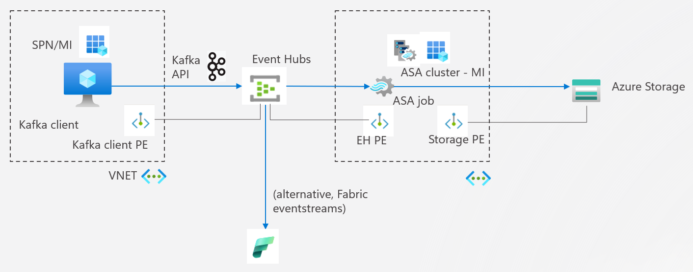
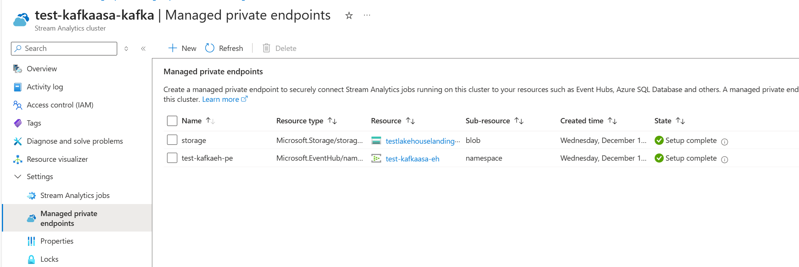
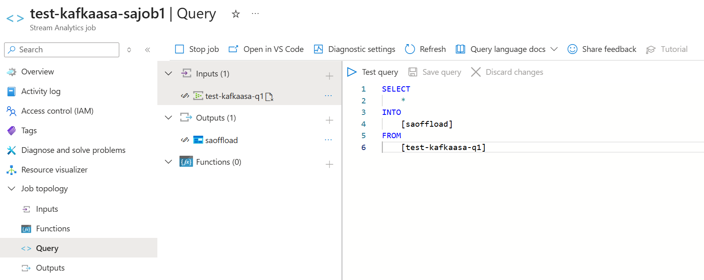

# Kafka API → Event Hubs → ASA (MI + Private Endpoints)

This sample is based on [Apache Kafka Confluent Python client using oauth](https://github.com/Azure/azure-event-hubs-for-kafka/tree/master/tutorials/oauth/python) and expanded to read data using Azure Stream Analytics using Managed Identies and Private Endpoints.

This tutorial will show how to create and connect to an Event Hubs Kafka endpoint using Azure Active Directory authentication. Azure Event Hubs for Apache Kafka supports [Apache Kafka version 1.0](https://kafka.apache.org/10/documentation.html) and later. Subsequently, data is read from Event Hubs using an Azure Stream Analytics (ASA) job running on an ASA cluster. The ASA job then writes the data to an Azure storage account. The Managed Identity of th ASA cluster is used to authenticate to Event Hubs and storage, the Managed VNET of the cluster is used to create private endpoints. The Kafka client can also be secured with private endpoints. If the clients runs on a laptop for test purposes, the IP address can be with listen on the Event Hubs firewall. See also image below.



## Producer - Kafka client

Event Hubs integrates with Microsof Entra ID, which provides an OAuth 2.0 compliant authorization server. Azure role-based access control (Azure RBAC) can be used to grant permissions to Kafka client identities.

To grant access to an Event Hubs resource, the security principal must be authenticated and an OAuth 2.0 token is returned. The token is then passed as part of the request to the Event Hubs service to authorize access to the resource. This is done by setting the appropriate values in the Kafka client configuration. On the Event Hubs, the role `Azure Event Hubs Data Sender` is needed such that the client is authorized to send data to Event Hubs.

For more information on using Microsoft Entra ID with Event Hubs, see [Authorize access with Microsoft Entra ID](https://docs.microsoft.com/en-us/azure/event-hubs/authorize-access-azure-active-directory#overview)

In case the client is run on a virtual machine or containerized solution in a network, a private endpoint can be created. Subsequently, a managed identity can be used rather than a service principal. The library `DefaultAzureCredential` detects automatically what is used.

## Consumer - Azure Stream Analytics

Data can be fetched from an Event Hubs using an Azure Streaming Analytics (ASA) jobs. Data can be analyzed using Windowing functions and processed downstream to do realtime analytics. In this example, the data is just writte to a storage account. An ASA job is deployed with a Manged Identity that can be used to authenticate to Event Hubs. On the Event Hubs, the role `Azure Event Hubs Data Consumer` is needed such that the client is authorized to read data to Event Hubs. Subsequently, th role `Storage Blob Data Contributor` is needed such that you can write data to your storage account.

To enhance security, an Azure Stream Analytics job can be run on an [ASA cluster](https://learn.microsoft.com/en-us/azure/stream-analytics/create-cluster). Managed private endpoints can be then be deployed to access the Events Hubs and Storage account via private link. See also image below.




In your streaming analytics job, add the Event Hubs as the source and Azure storage as sink. A simple ASA job is displayed that takes all data from Event Hubs and writes data to Storage



## Alternative Consumers - Fabric eventstreams, Azure Databricks Structured Streaming, ...

Event Hubs integrate well in Microsoft Fabric. Data can be fetched in parallel from Event Hubs using Fabric streaming to do more advanced analytics. See this documentation how Event Hubs can be added to Fabric Streaming: https://learn.microsoft.com/en-us/fabric/real-time-intelligence/event-streams/overview?tabs=enhancedcapabilities

Also, Azure Databricks works well together with Event Hubs. Follows this tutorial how toe process from Event Hubs using Structured Streaming: https://learn.microsoft.com/en-us/azure/databricks/ldp/event-hubs

## Prerequisites

If you don't have an Azure subscription, create a [free account](https://azure.microsoft.com/free/?ref=microsoft.com&utm_source=microsoft.com&utm_medium=docs&utm_campaign=visualstudio) before you begin.

You'll also need:

* [Git](https://www.git-scm.com/downloads)
* [Python](https://www.python.org/downloads/)
* [Pip](https://pypi.org/project/pip/)


## Getting ready

Now that you have an Event Hubs namespace, clone the repository and navigate to the `https://github.com/rebremer/eventhubs-kafka-to-asa` directory:

```bash
git clone https://github.com/rebremer/eventhubs-kafka-to-asa
cd eventhubs-kafka-to-asa
```

Install the sample dependencies (it is recommended to setup a virtual environment first when code is run locally: https://docs.python.org/3/library/venv.html):

```shell
python -m pip install -r requirements.txt
```

## Running the code in GitHub

### Configuring credentials

In this example, a service principal is used for the Microsoft Entra ID credential. This service principal must have the `Azure Event Hubs Data Sender` role (or equivalent) assigned on the target Event Hubs namespace. We configure `DefaultAzureCredential` by setting the following environment variables in the .env file (rename env.example to .env):

```shell
AZURE_TENANT_ID=<TenantID>
AZURE_CLIENT_ID=<AppClientId>
AZURE_CLIENT_SECRET=<AppSecret>
EVENTHUB_NAMESPACE=<Name of EH>.servicebus.windows.net
EVENTHUB_NAME=<Name of queue in EH>
```

Run the code in `producer.py`. Code in `consumer.py` can be adjusted to fetch data direclty from Event Hubs using Kafka API, but scope of this documentation is to do this via ASA.
